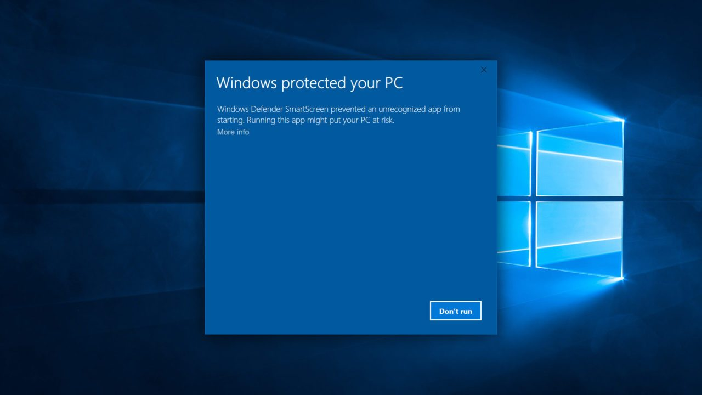

# Troubleshoot
This section will help resolve some of the issues you might run into, following the document.

## Installation Issues

### Error: Command 'npm' not found
This error means that you do not have NPM installed. NPM gets installed, alongside NodeJs. To donwload NodeJs and NPM go to [nodejs.org](https://nodejs.org/)

### Error: Windows Protected Your PC
When using the Heorku Windows installer, you might run into the following error:

To resolve the error, click on "More info" and press “Run anyway”.

***

## NodeJs Runtime Errors

### Error: Port Already in Use

You might encounter this messages, while trying to run your ExpressJs application:

~~~
events.js:288
      throw er; // Unhandled 'error' event
      ^
Error: listen EADDRINUSE: address already in use :::3000
~~~

To resolve this issue run the command `killall node`, and try running `npm start` again.

### Error: Cannot find module 'twitter'
The error might occure when running your ExpressJs application.
~~~
internal/modules/cjs/loader.js:985
  throw err;
  ^

Error: Cannot find module 'twitter'
~~~

This error means that the Twitter NPM module has not been correctly installed. To resolve, open terminal and run `npm install twitter`.
