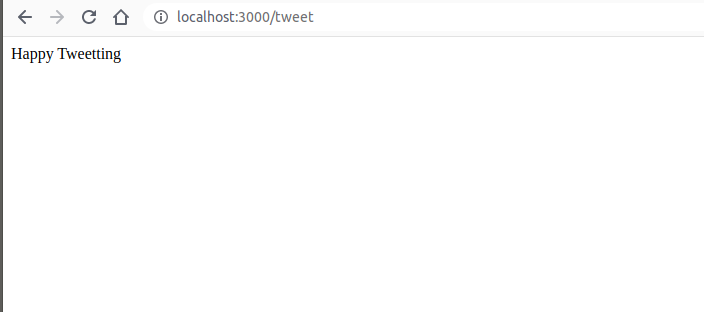

# Account Configuration
Twitter Standard API requires the developers to create a developer account on your app before you can access the users' data. 
In the following steps, we walk through how we can set up our account and integrate our app with Twitter Standard API.

***

## Developer Dashboard
A developer account will give you access to the developer dashboard which lets us set up apps and the developer environment. The dashboard is where we ask Twitter for permission to use their API and give them the information they need, about the app. By applying for a developer account, you will give be able to grant access to your account, from your app.

### Applying for a developer account
Sign in with your Twitter account. If you don't have one, go to [Sign up for Twitter](https://twitter.com/i/flow/signup) to create an account.


In order to apply for a developer account, go to [Apply for a developer account](https://developer.twitter.com/en/apply).
We will choose a student account for the purposes of this tutorial. 


Once you click on next, you will have to choose your country of residance and a name, by which you will be called. Click next.


Next, you will be required to write about the app you will connect to the api. Based on the features you will use, you are required to write different paragraphs, mostly describing how you will use the feature.


You will be asked to confirm your information. Makes sure they're correct and click on the "Looks Good" button.


Lastly, you will be requiried   Terms of use.
> Note: you will be have to have confirmed your email address before you can compelete this step.
{: .label .label-green }

Once done, you will be shown a message, to confirm that you applied for a Twitter Developer Account.


### Preparing your URL endpoints

Twitter will require a set of URL's from you. Those URL's will tell Twitter where to expect the requests to come from. If requests are sent from any other URL, twitter will not authorize your program, even if the currect API key and token are used.
>Note: Twitter will not accept local URL's(i.e. localhost/ ) as the URL for app.
{: .label .label-green }


Twitter will email you a link, to confirm your email, for the developer account. After following the link email to you, you will be taken to your developer dashboard, where you can set up new apps, get API keys and set up your end points.

Before we go any further, We will need to set up and deploy our app In order to have the URL's that twitter is expecting from us. We will make a simple Express app and we will deploy it to Heorku, to provide Twitter with the ened points it needs.

<!-- We will come back to the developer dashboard to set up our app and introduce our URL. -->
So, let's go ahead and create our application.

# Setting up our NodeJs and Express
We will create a simple, boiler plate Node Js server, using ExpressJs. We will be required to provide the URL of the app in the developer dashboard.

## Boilerplate Express
Let's start with making a directory for our project and adding a server.js file.


```
mkdir TwitterAPI
cd TwitterAPI
ls
touch server.js
npm init -y
```


Then, let's install Express from npm
```
npm i express
```
Once Express is installed, we can go to our server.js file and create our server.

In our server.js file, we'll add our "/" endpoint.
```
const express = require('express')
const app = express()
 
app.get('/', (req, res) => {
  res.send('Twitter API')
})
 
app.listen(process.env.PORT || 3000 , () => console.log("The server is listening on port 3000"))

```
Now if we run the server.js file we will see the message printed in the terminal; and, the word will be shown, if we go to our browser and go to "localhost:3000".


> process.env.PORT is an enviroment variable that will be provided by Heorku, when we upload app. The `||` operator will indicate that if the enviroment variable does not exist( i.e. when running locally) the port will alternatively be 3000.

## Adding a tweet endpoint
This endpoint will help us directly post content to our Twitter account. We will set up this endpoint to practice using the post functionality of the API, as well.
```

app.get('/tweet' , (req,res) => {
    res.send('Happy Tweetting')
})

```



We will revisit and mofidy our app, later on; But, now let's deploy our app to heroku.

