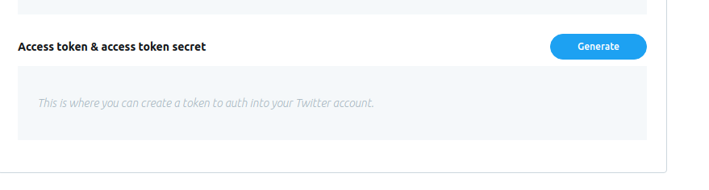
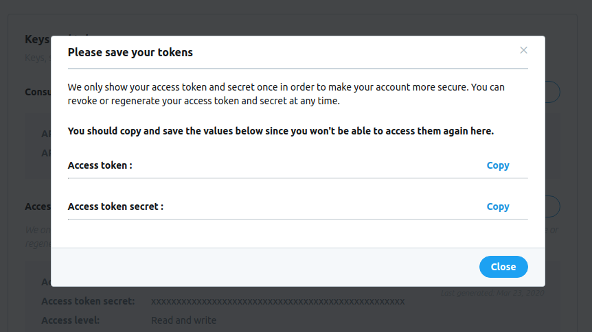
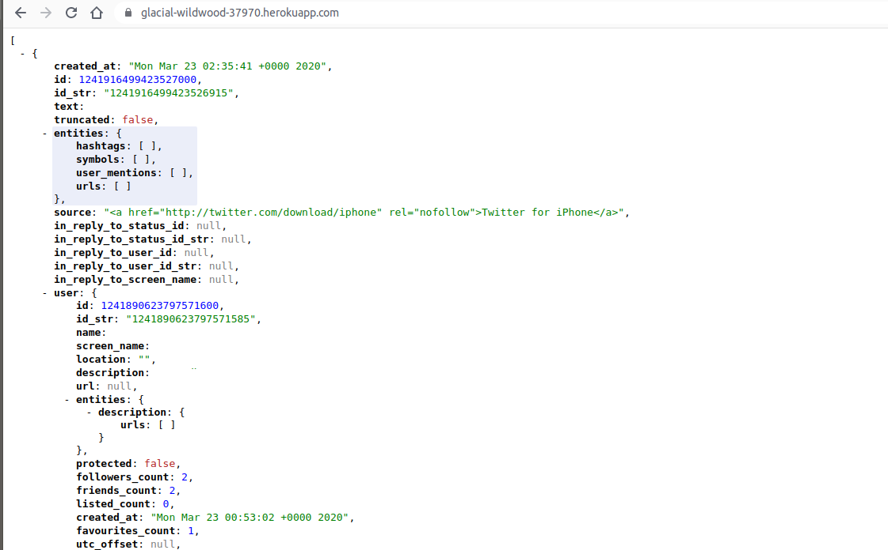

# Setting our endpoints in developer dashboard
Now that we have created and deployed our app, we will have to submit its URL to Twitter. This will help Twitter, identify and authorize our app.
## Dashboard
Go back to your dashboard at [developer.twitter.com](https://developer.twitter.com/), and Log-in if you need to.
### Going to apps page
Under your name, click on the "Apps" option.

### Create an app
Click on the button to create an app, on the top corner of your page.

## Entering the app information
You will have to lay out some information about the app that will be using Twitter's Standard API. This information will help Twitter trust your application and supply it with the information you will need. Make sure you write your responses consise and clear.
### Application name and description
Provide your application name and a breif description of what it will be aiming to accomplish.

### Base URL
Enter the URL for the root of your application. This will be the URL that Heorku has given us, when deploying.

### Callback URL
This endpoint is the endpoint that the Twitter will send the users to, when they have signed in. Since we are not implementing OAuth in our application, we won't need to implement this endpoint in our application.

> Note: Make sure you include the entire URL concatinated with the endpoint inside the field( i.e. https://glacial-wildwood-37970.herokuapp.com/returned)
{: .label .label-green }

### Further Description
We will have to enter more description on how our app will be using the API. Write a more in depth explanation of how the app will work and what it aims to do.

### Creating the app
Press create to submit the information.

Review the information in the confirmation page.

### Getting your access token
Click on "Keys and tokens" on the top menu bar.

You will be able to see your API Key and API Secret Key in this page. 

Twitter will identify us from these keys, when we send any requests to the API.
> Warning: Keep these information safe and do not share them with anyone.
{: .label .label-yellow }

***

## Getting our Access Token
By generating an access token and a token secret, you are permitting your app to access your account information. In other words, you will be using your own Twitter account as a test account, for your application.

### Generating tokens
Click on the "Generate button to generate your access token and token secret."

Once generated, keep the API keys safe and do not share them with anyone.

***
# Connecting our application
Let's go back to our application, and actually implement some Twitter functionalities.
## Working with Twitter's npm package
We will use Twitter's npm package, to simplify the process of requesting and getting response to and from Twitter.
### Installation
To install the package, open your terminal in your project. Run:
~~~shell
npm install twitter
~~~
### Requireing in your application
Go to your server.js file and require the package, on the top.
~~~javascript
  var Twitter = require('twitter');
~~~
### Set up the API Keys and Tokens
inside your `/` route, use this code to create an object of the Twitter class.
~~~javascript
var client = new Twitter({
    consumer_key: '[API key]',
    consumer_secret: '[API secret]',
    access_token_key: '[generated access token]]',
    access_token_secret: '[generated token secret]'
  });
~~~
After creating the object, you will be able to call a get method on it, to fetch information, from a intended endpoint, in Twitter's API.
### Sending your first request
We will call the `/favorites/list/` endpoint to get the favorite Tweets for your account.
~~~javascript
 client.get('favorites/list', function(error, tweets, response) {
    if(error) throw error;
    res.json(tweets);
  });
~~~
This code will send all of the favorite tweets, to the client, as a JSON array. 

At the end, my `/` route looks like this:
~~~javascript
app.get('/', (req, res) =>  {

  var client = new Twitter({
    consumer_key: '3miSSIBb4l4xIyBTMFLwbWo0s',
    consumer_secret: 'ZhznnauyH8DOg3uov3AdgQMRUGrQmAem2aBVfGV5VazlEafJTQ',
    access_token_key: '904009473924018176-fisMiBozBSv2ZKIdblizmXuYwlcSVpC',
    access_token_secret: '05h0Yv9om2KThGNdrwM0HTm4xGOtI6UskYlSq5N0tBT3X'
  });
  client.get('favorites/list', function(error, tweets, response) {
    if(error) throw error;
    res.send(tweets);
    console.log(response);
  });
  
})
~~~  

> Note: The demonstrated API Keys and Tokens are invalide.
{: .label .label-green }

***

## Deploying the app
In order for our app the be recognized by Twitter, we will have to deploy the new code, to replace the old one.
Add, commit and push your code to Heorku.
### Push your code
Push your code to Heorku's remote using the commands below.
~~~shell
git add .
git commit -m 'Favorite function is implemented'
git push heroku master
~~~ 
### Open your app in a browser
Open your app in browser using its URL or run `heroku open`:

And with that, you have successfully implemented your first Twitter Standard API feature.

